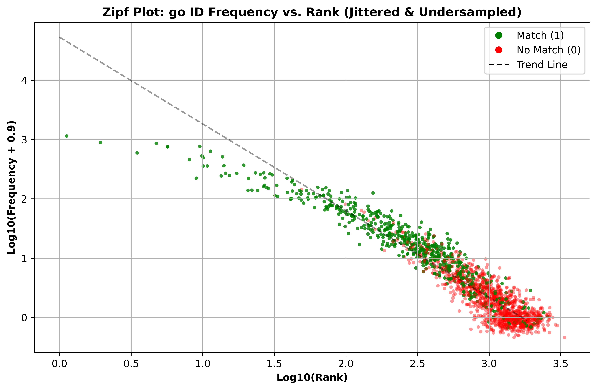

# Ontology-Term-ID-Mapping

**Repository for the paper: _Mapping Biomedical Ontology Terms to IDs: Effect of Domain Prevalence on Prediction Accuracy_**

📄 _Submitted to IEEE, 2025_  
👨‍🔬 Authors: Thanh Son Do, Daniel B. Hier, Tayo Obafemi-Ajayi

---

## 📘 Overview

This repository contains the code, datasets, and results associated with our study evaluating how the prevalence of biomedical ontology IDs in the literature predicts the accuracy of ontology term-to-ID mapping by large language models (LLMs) like GPT-4.

We investigate four mappings:
- HPO terms → HPO IDs
- GO terms → GO IDs
- Protein names → UniProtKB accession numbers (AC)
- Protein names → HUGO gene symbols (GS)

We analyze performance using correlation, binning, Zipf plots, logistic regression, and ROC curves.

---

## 📁 Repository Structure

```
/scripts/
    hpo_analysis.py         # Analysis pipeline for HPO mappings
    go_analysis.py          # Analysis pipeline for GO mappings
    ac_analysis.py          # Analysis pipeline for UniProtKB AC mappings
    gn_analysis.py          # Analysis pipeline for gene symbol mappings

/data/
    hpo_with_matches.csv    # Ground truth and predictions for HPO terms
    go_with_matches.csv     # Same for GO
    ac_with_matches.csv     # Same for UniProtKB accession numbers
    gn_with_matches.csv     # Same for gene symbols

/results/
    *.png                   # All figures from the paper (Zipf, ROC, bin plots, etc.)
    *.csv                   # Optional filtered analysis output (e.g., for Zipf)
```

---
🧠 Key Findings
	•	📈 Mapping accuracy increases with ontology ID frequency in PMC for HPO, GO, and UniProtKB.
	•	🔠 GPT-4 performs consistently well on gene symbol mapping (GS), likely due to lexical familiarity.
	•	🎯 ROC-based thresholds help define mappable vs. unmappable terms.
	•	🧮 Zipf plots and bin analyses reveal a strong frequency-performance relationship.


📝 See full paper for detailed results and interpretation:  
**_Mapping Biomedical Ontology Terms to IDs: Effect of Domain Prevalence on Prediction Accuracy_**

---
**Sample Zipf Plot for GO terms from cellular component hierarchy**

📊 Sample Zipf Plot: GO ID Frequency

This plot shows the Zipfian distribution of GO IDs and its impact on GPT-4 mapping accuracy.
   	•	🟢 Green = Correct mappings
	•	🔴 Red = Incorrect mappings
	•	⚫ Dashed line = Power-law trend

## 🚀 Getting Started

### Dependencies
- Python 3.8+
- `pandas`, `matplotlib`, `numpy`, `scikit-learn`, `statsmodels`

### Run an analysis

```bash
python scripts/hpo_analysis.py
python scripts/go_analysis.py
python scripts/ac_analysis.py
python scripts/gn_analysis.py
```

Each script produces:
- Summary statistics
- Bin plots
- Logistic regression fit
- ROC and precision-recall curves
- Zipf plots

---

## 📜 Citation

```bibtex
@article{hier2025ontology,
  title={Mapping Biomedical Ontology Terms to IDs: Effect of Domain Prevalence on Prediction Accuracy},
  author={Do, Thanh Son and Hier, Daniel B and Obafemi-Ajayi, Tayo},
  journal={IEEE (submitted)},
  year={2025}
}
```

---

## 📌 Notes

- All scripts are synchronized with the IEEE manuscript as of April 2025.
- For any issues, please contact Daniel Hier at `hierd@umsystem.edu`.
